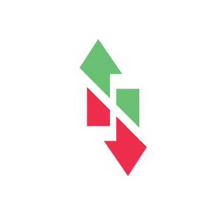

# Connection On/Off widget

<!---->

## Turn ON/OFF your data connection in 1 click!

Turn ON/OFF your data connection in 1 click!

<b>Just add the widget to your home screen after installation.</b>

<i>On Android 5 Lollipop due to a limitation introduced in this version is no longer possible to stop the connection.<b>We apologize for the inconvenience, we are working to solve the problem.</b></i>

If you find it useful, don'forget to rate this app.
For feedback or issues, please email us!

### License

This program is distributed in the hope that it will be useful, but WITHOUT ANY WARRANTY.
Backup your contacts before use, so you can get it back if necessary.

> THE SOFTWARE IS PROVIDED "AS IS", WITHOUT WARRANTY OF ANY KIND, EXPRESS OR
> IMPLIED, INCLUDING BUT NOT LIMITED TO THE WARRANTIES OF MERCHANTABILITY,
> FITNESS FOR A PARTICULAR PURPOSE AND NONINFRINGEMENT. IN NO EVENT SHALL THE
> AUTHORS OR COPYRIGHT HOLDERS BE LIABLE FOR ANY CLAIM, DAMAGES OR OTHER
> LIABILITY, WHETHER IN AN ACTION OF CONTRACT, TORT OR OTHERWISE, ARISING FROM,
> OUT OF OR IN CONNECTION WITH THE SOFTWARE OR THE USE OR OTHER DEALINGS IN THE SOFTWARE.

### Privacy Policy

"Connection On/Off widget" app don't store or transmit your information beyond your phone.

This app don’t collect "personally identifiable information"(PII), but collect non-personally identifiable information using third party services. This is the list of third party services used in the app:
- Google Play app statistics: Google collect app usage statistics, and we used it improve our apps
- Google AdMob: Google's advertising requirements can be summed up by Google's Advertising Principles. They are put in place to provide a positive experience for users. [AdMob & AdSense policies](https://support.google.com/admob/answer/6128543?hl=en)

In general, this is what the Google Privacy Policy page says about opt-out: “View and edit your preferences about the Google ads shown to you on Google and across the web, such as which categories might interest you, using Ads Settings. 
You can also visit that page to opt out of certain Google advertising services.” (Google Privacy Policy) “Review and control certain types of information tied to your Google Account by using Google Dashboard.” ([Google Privacy Policy](https://policies.google.com/privacy?hl=en))

*Last Edited on 2018-05-12*